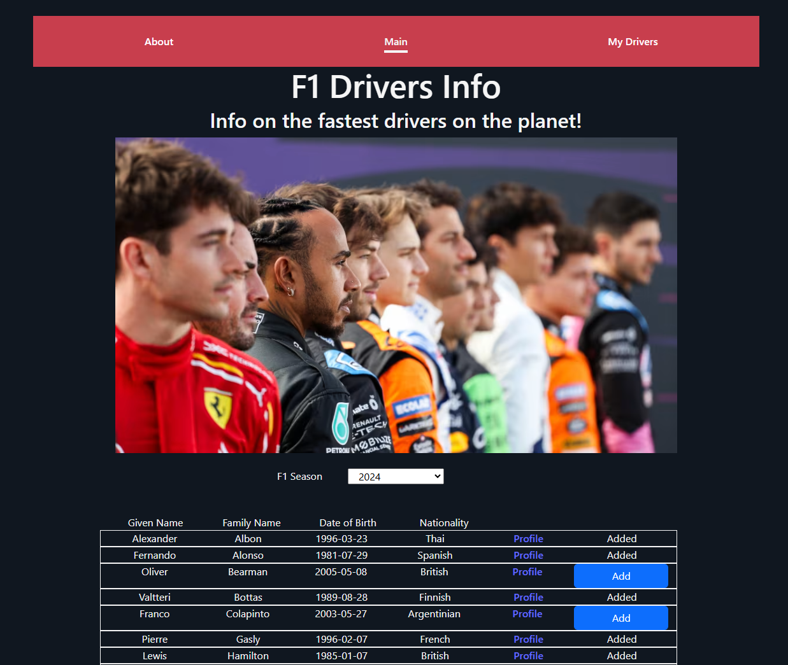

# F1 Drivers App

Who doesn't like trivia? My group of university mates often talk about Formula 1 (F1) when we hang out! It is something that we follow up regularly, and we would make an effort to make time to attend the Singapore Grand Prix together every year! During our meetups, whenever we approach the topic of F1, we will discuss about the drivers. So I figured, why not have an app where we could look up driver's information on the go, and do some fact checks as well. I believe this would be a fun app to use, and I have created a section, where you can save some of your favourite drivers for quick access to their profile and details.

```
“We win and lose together.” – Lewis Hamilton.
```

# Getting started

After cloning the repo to your computer, you will need to create a .env file in your root folder. Then, add in the following line:-

```
VITE_TOKEN=abc
```

where abc is your airtable Personal access token. This is because there are fields which needs authorisation in order for them to function correctly.

Next, you would need to create an airtable with the following parameters:-

- airtable with 7 columns
- columns to be set up as single line text fields.
- column labels from left to right; driverId, givenName, familyName, dateOfBirth, nationality, url, imageUrl

Finally, ensure you are at the root folder of this repo, using gitbash, key 'npm i' to install the necessary dependecies, and key in 'npm run dev' to try out the application on your web browser. I would recommend to use the chrome browser, as the application was created and tested on chrome.

If you are intending to edit the codes, do note that I have used TanStack queries. Do visit their site to learn more. To get started with TanStack, you would need to install their dependencies package using 'npm i @tanstack/react-query'

# Using the app

Upon running the app, you will be greeted at the main page with a list of all the drivers. I have set a default to show 30 drivers (there are actually 860 entries currently). Should there be a need to show all entries, then a limit query parameter may be set up by amended the codes. All you need to do is follow these steps:

```
Look for the folder name src -> pages -> Main.jsx
Amend the url of line 11, by adding '?limit=x',
where x is the number of drivers you wish to be displayed on the main page. You may refer to the below example for reference.
```

### Example

```javascript
const getData = async () => {
    const res = await fetch(
      "http://ergast.com/api/f1/drivers.json?limit=10" // this will show 10 drivers only at the main page
    );
```

You may use the drop down menu to select your preferred F1 season. This narrows your search for a particular driver, or perhaps you are just curious to know who won the championship that year!

After chosing a year, you may scroll down to see the 'End of Season Standings' of the driver. It will show details such as the ranking, the points scored, and the number of race win of the drivers that season.

You may click on the 'Profile' button to be directed to their wikipedia page where more information about the driver may be found. You may click the 'Add' button, to add the driver to your 'My Drivers' list for easy reference. A pop up will appear, asking if you would like to add more drivers. If you click 'Yes', then you will stay at the current page to select more drivers. If 'No' is selected, then you will be directed to 'My Drivers', which is the list of drivers you have added.

From here, you may click on the 'Profile' to learn more about the driver too. Upon clicking the 'Remove' button, the driver will be deleted from your 'My Driver' list. You will also notice that now, the drivers in your 'My Drivers' list has a photo! Clicking on it will open up a new google image search tab for more eye candies. If the app was not able to show the picture of the driver, a link will appear for you to click, and a new tab will appear with google image search of the driver.

# Attributions

For the data, credit goes to Ergast API. Information was obtained from here:-
- [Ergast API](https://documenter.getpostman.com/view/11586746/SztEa7bL#intro)

For designs, I have used bootstrap for the overall html styling:-

- [Bootstrap](https://getbootstrap.com/)

Images are obtained from these sites:-

- [Formula 1](https://www.formula1.com/en/latest/article/driver-of-the-day-2024.1I7A0iPl3nMaXyPIeFVFLZ)
- [Racingnews365](https://racingnews365.com/schedule-for-the-f1-2022-singapore-grand-prix)
- [Motorsport](https://www.motorsport.com/)
- [Wikipedia](https://en.wikipedia.org)

Whenever I got stuck, or faced difficulties in implementing the codes or ideas, I would refer to the following for examples and write ups:-

- [W3Schools](https://www.w3schools.com/)
- [MDN](https://developer.mozilla.org/en-US/)
- [stackoverflow](https://stackoverflow.com/)
- [General Assembly Course Notes](https://generalassemb.ly/)
- [MediaWiki](https://www.mediawiki.org/wiki/API:Query)
- [React](https://react.dev/learn)
- [TanStack Query](https://tanstack.com/query/latest)
- [Airtable Developers](https://airtable.com/developers)

# Technologies Used

1. HTML
1. CSS
1. JavaScript
1. React
1. Visual Studio
1. Github
1. Chrome
1. Bootstrap
1. Docker
1. Postman
1. Airtable
1. Trello
1. Wireframe.cc
1. MS Powerpoint

# Next Steps

Next steps: Planned future enhancements (stretch goals).

- Add more filter/conditions to filter drivers
- Add a schedule of the current season
- Add race results
